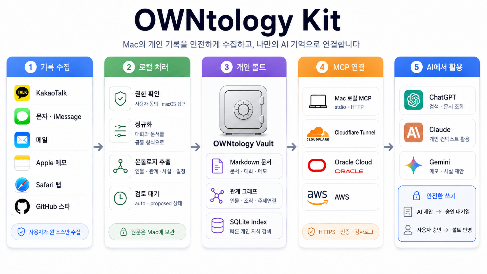

# owntology-kit



내 **카카오톡 · 문자(SMS/iMessage) · 메일 · Apple 메모 · Safari 탭 · GitHub 스타(선택)** 를
수집해서 개인 온톨로지 볼트(마크다운 지식 저장소)로 만들어 주는 킷입니다.
owntology 개인 볼트 파이프라인을 누구나 쓸 수 있게 설정 분리한 버전입니다.

- 로컬 전용 — 수집 데이터는 기기를 떠나지 않습니다(자세히: [PRIVACY.md](PRIVACY.md))
- 외부 pip 의존성 **0개** (Python 3.11+ stdlib만)
- 개인값(닉네임·계정·경로)은 전부 `config.json` — 웹 화면에서 입력
- **수집 소스 기본값은 전부 꺼짐** — 웹에서 명시적으로 켜야 수집합니다(암묵적 대량 수집 방지)
- 자동 추출은 전부 `extraction: auto` / `status: proposed` — 확정은 사용자 몫

> ⚠️ **개인정보**: 볼트에는 카카오톡·문자·메일 등 원문이 **평문**으로 저장되며, 대화 상대 등
> 제3자의 개인정보가 포함됩니다. 개인용으로만 쓰고 공유/공개 폴더에 두지 마세요. [PRIVACY.md](PRIVACY.md) · [SECURITY.md](SECURITY.md)

## 빠른 시작

```bash
python3 kit.py init      # ① config.json 생성 + 볼트 폴더 스캐폴드
python3 kit.py web       # ② http://127.0.0.1:8765 에서 설정 입력 (닉네임·수집 소스 켜기)
python3 kit.py doctor    # ③ 환경·권한·설정 사전 점검 (FAIL 있으면 먼저 해결)
python3 kit.py run       # ④ 수집 + 온톨로지화 원터치
python3 kit.py web       # ⑤ 인물 관계·전화·방 이름 등 수동필드 입력
```

기본 소스가 전부 꺼져 있으므로 ②에서 켜지 않으면 ④는 아무것도 수집하지 않습니다.
이후 갱신은 `python3 kit.py run` 만 반복하면 됩니다(멱등).
카카오 DB 복호화(katok sync)가 오래 걸리면 `--fast-kakao` 로 직전 아카이브에서 export만 합니다.
카카오 수집은 본인 닉네임이 없으면 건너뜁니다(본인 메시지 "나" 매핑에 필요).
수집이 끝나면 **성공/실패/건너뜀 요약**이 출력되고, 시도한 핵심 수집기가 모두 실패하면 종료 코드가 0이 아닙니다.

## 🤖 Codex·Claude Code로 설치하기

OWNtology-Kit을 직접 설치하기 어렵다면, **Codex CLI** 또는 **Claude Code**에 아래 프롬프트를 전달해 설치를 진행할 수 있습니다.

> 실제 개인정보 수집은 사용자가 수집 대상을 직접 선택하고 동의한 이후에만 진행하도록 구성된 프롬프트입니다.

<details>
<summary><strong>Codex·Claude Code 설치 프롬프트 펼쳐 보기</strong></summary>

<br>

아래 내용을 전체 복사해 Codex 또는 Claude Code에 입력하세요.

---

당신은 macOS 로컬 환경에서 GitHub 저장소를 안전하게 설치하고 검증하는 개발 도우미입니다.

다음 저장소를 현재 사용자 PC에 설치하고, 사용자가 자신의 개인 데이터를 수집할 수 있도록 초기 설정까지 진행해 주세요.

저장소:

```text
https://github.com/jhny-kor/OWNtology-Kit
```

## 목표

* 저장소를 사용자 홈 디렉터리 아래 적절한 위치에 clone
* 실행 환경과 필수 도구 점검
* OWNtology-Kit 초기화
* 웹 설정 화면 실행 준비
* 사용자가 직접 개인정보 수집 소스를 선택하도록 안내
* 설정 완료 후 doctor 검사와 테스트 실행
* 실제 데이터 수집은 사용자의 명시적 선택 이후에만 실행
* 설치 결과와 남은 조치사항을 명확히 보고

## 중요 조건

1. 이 프로젝트는 macOS 로컬 사용을 기준으로 판단하고 진행하세요.
2. 사용자 동의 없이 카카오톡, 문자, 메일, Apple 메모, Safari 탭을 수집하지 마세요.
3. 수집 소스는 기본적으로 모두 꺼진 상태를 유지하세요.
4. `config.json`이나 개인 볼트 내용을 Git에 커밋하지 마세요.
5. 볼트 경로를 iCloud Drive, Dropbox, Google Drive, OneDrive 등 동기화 폴더에 생성하지 마세요.
6. 기존 설치나 기존 `config.json`, 기존 볼트가 있으면 삭제하거나 덮어쓰지 말고 먼저 상태를 확인하세요.
7. `sudo`는 반드시 필요한 경우에만 사용하고, 사용 전 이유를 설명하세요.
8. API 키, 비밀번호, 인증 토큰을 출력하거나 파일에 직접 기록하지 마세요.
9. 실제 개인정보 수집 전 어떤 데이터가 평문으로 저장되는지 반드시 사용자에게 알리세요.
10. 설치 과정에서 오류가 발생하면 임의로 우회하지 말고 원인, 영향, 해결 방법을 설명하세요.
11. 사용자의 기존 Git 변경사항을 임의로 reset, checkout, stash, 삭제하지 마세요.
12. 개인정보가 포함된 파일의 본문을 터미널이나 최종 보고서에 출력하지 마세요.

## 권장 설치 위치

```text
~/Developer/OWNtology-Kit
```

해당 경로가 이미 존재하면 현재 상태를 먼저 확인하고 안전하게 재사용하세요.

---

## 1. 시스템 확인

다음을 확인하세요.

* 운영체제가 macOS인지
* macOS 버전
* CPU 아키텍처가 Apple Silicon인지 Intel인지
* Python 버전이 3.11 이상인지
* Git 설치 여부
* Homebrew 설치 여부
* 현재 사용 중인 셸
* 설치 대상 경로 존재 여부
* 기존 `config.json` 존재 여부
* 기존 개인 볼트 존재 여부

예시 명령:

```bash
sw_vers
uname -m
python3 --version
git --version
brew --version
echo "$SHELL"
ls -la ~/Developer/OWNtology-Kit 2>/dev/null
```

macOS가 아니라면 설치를 계속 진행하지 말고, 현재 OWNtology-Kit의 주요 데이터 수집 기능이 macOS 환경을 요구한다고 설명하세요.

Python 3.11 이상이 없다면 Homebrew가 설치된 경우 Homebrew로 설치하세요.

```bash
brew install python@3.12
```

설치 후 실제 사용할 Python 경로와 버전을 확인하세요.

```bash
which python3
python3 --version
```

Homebrew Python이 기본 PATH에 잡히지 않는다면 다음 경로도 확인하세요.

Apple Silicon:

```bash
/opt/homebrew/bin/python3 --version
```

Intel Mac:

```bash
/usr/local/bin/python3 --version
```

---

## 2. 저장소 설치

저장소가 없다면 clone하세요.

```bash
mkdir -p ~/Developer
cd ~/Developer
git clone https://github.com/jhny-kor/OWNtology-Kit.git
cd OWNtology-Kit
```

이미 저장소가 있다면 먼저 다음을 확인하세요.

```bash
cd ~/Developer/OWNtology-Kit
git status
git remote -v
git branch --show-current
git log -1 --oneline
```

사용자의 변경사항이 있으면 `git pull`, `git reset`, `git checkout`, `git clean`을 임의로 실행하지 마세요.

변경사항이 없고 원격 저장소가 올바른 경우에만 최신 `main` 브랜치로 업데이트하세요.

```bash
git pull --ff-only origin main
```

`--ff-only`로 업데이트할 수 없다면 강제로 병합하지 말고 사용자에게 상태를 보고하세요.

---

## 3. 저장소 안전성 확인

다음을 확인하세요.

```bash
git status
git ls-files config.json
git check-ignore -v config.json
test -f LICENSE && echo "LICENSE 있음"
test -f PRIVACY.md && echo "PRIVACY.md 있음"
test -f SECURITY.md && echo "SECURITY.md 있음"
```

확인 목표:

* `config.json`이 Git 추적 대상이 아닌지
* `config.json`이 `.gitignore`에 포함되어 있는지
* 개인 데이터가 저장소 내부에 생성되지 않는지
* `LICENSE`, `PRIVACY.md`, `SECURITY.md`가 존재하는지

저장소에 실제 사용자의 다음 정보가 포함된 파일이 발견되면 설치를 중단하고 보고하세요.

* 실제 카카오톡 대화
* 실제 SMS/iMessage
* 실제 메일 본문
* 실제 전화번호
* 실제 주소
* API 키
* 인증 토큰
* 비밀번호
* 개인 볼트
* 개인용 `config.json`

단, 테스트 코드에 포함된 명백한 가상 샘플 데이터는 실제 개인정보와 구분하세요.

개인정보나 시크릿을 검사할 때 파일 전체 내용을 출력하지 말고, 파일 경로와 문제 유형만 보고하세요.

---

## 4. 초기화

다음을 실행하세요.

```bash
python3 kit.py init
```

사용 중인 Python이 `python3`가 아니라 별도 Homebrew 경로라면 정확한 실행 파일을 사용하세요.

예:

```bash
/opt/homebrew/bin/python3 kit.py init
```

초기화 후 다음을 확인하세요.

* `config.json` 생성 여부
* 기본 볼트 경로
* 볼트 디렉터리 생성 여부
* 모든 수집 소스가 `false`인지
* 볼트 경로가 클라우드 동기화 경로가 아닌지

`config.json`의 실제 값을 검사하되 API 키나 개인정보가 있으면 출력하지 마세요.

필요한 경우 다음처럼 수집 소스 상태만 안전하게 확인하세요.

```bash
python3 - <<'PY'
import json
from pathlib import Path

p = Path("config.json")
if not p.exists():
    raise SystemExit("config.json 없음")

cfg = json.loads(p.read_text(encoding="utf-8"))
print("vault_path:", cfg.get("vault_path"))
print("sources:", cfg.get("sources"))
PY
```

기본 볼트 경로는 다음입니다.

```text
~/Documents/my-owntology
```

사용자의 `Documents` 폴더가 iCloud Drive에 동기화되는 환경이면 다음처럼 로컬 전용 경로를 권장하세요.

```text
~/OWNtology/my-owntology
```

경로를 변경할 때는 사용자의 동의를 받은 후 `config.json`에 반영하세요.

기존 볼트가 존재하면 삭제하거나 초기화하지 말고 다음을 확인하세요.

* 기존 파일 개수
* 주요 폴더 존재 여부
* 마지막 수정 시간
* 기존 사용 데이터가 있는지

기존 파일의 개인정보 본문은 출력하지 마세요.

---

## 5. 사전 환경 검사

다음을 실행하세요.

```bash
python3 kit.py doctor
```

결과를 다음 상태로 구분해 정리하세요.

* `OK`
* `WARN`
* `FAIL`

`FAIL`이 있으면 실제 데이터 수집을 진행하지 마세요.

`WARN`이 있으면 다음 사항을 구분하세요.

* 실제 수집을 막는 경고
* 사용자가 인지하면 되는 개인정보 경고
* 특정 소스를 사용하지 않으면 무시할 수 있는 경고

---

## 6. 선택 기능별 도구 설치

사용자가 활성화하려는 기능에 필요한 도구만 설치하세요.

모든 수집 도구를 일괄 설치하지 마세요.

### 6.1 카카오톡 수집

필요한 항목:

* Rust와 Cargo
* `katok` CLI
* 사용자의 카카오톡 프로필 닉네임
* macOS 카카오톡 로컬 데이터 접근 가능 환경

먼저 Rust 설치 여부를 확인하세요.

```bash
rustc --version
cargo --version
```

Cargo가 없다면 Homebrew 설치를 우선 고려하세요.

```bash
brew install rust
```

그다음 저장소 README에서 요구하는 방식과 `katok` 공식 저장소의 최신 설치 방법을 확인해 설치하세요.

기본 예시:

```bash
cargo install katok
```

설치 후 확인하세요.

```bash
which katok
katok --help
```

`katok`이 설치됐지만 PATH에서 찾지 못한다면 다음 경로를 확인하세요.

```bash
ls -la ~/.cargo/bin/katok
```

`~/.cargo/bin`이 PATH에 없다면 현재 셸 설정 파일에 중복 없이 추가하세요.

zsh를 사용하는 경우 일반적으로 다음 파일을 확인하세요.

```text
~/.zshrc
~/.zprofile
```

추가 예시:

```bash
export PATH="$HOME/.cargo/bin:$PATH"
```

셸 설정 파일을 수정했다면 중복 항목을 만들지 말고, 변경 내용을 사용자에게 보고하세요.

카카오 수집을 켜기 전에 반드시 사용자의 정확한 카카오톡 프로필 닉네임을 입력하도록 안내하세요.

닉네임을 추측하지 마세요.

카카오 수집을 시작하기 전에 사용자가 제외할 대화방을 설정하도록 안내하세요.

### 6.2 SMS/iMessage 수집

필요한 항목:

* OWNtology-Kit이 지원하는 `imsg` CLI
* 터미널 또는 Codex·Claude Code를 실행하는 앱의 Full Disk Access 권한

저장소 README에서 지원하는 `imsg` 구현체와 명령 형식을 확인한 뒤 설치하세요.

설치 후 다음 명령 형식이 동작하는지 확인하세요.

```bash
imsg chats --json
```

권한 오류가 발생하면 사용자에게 다음 경로를 안내하세요.

```text
시스템 설정
→ 개인정보 보호 및 보안
→ 전체 디스크 접근 권한
→ Terminal, iTerm2, Codex 또는 Claude Code를 실행 중인 앱 허용
```

권한을 변경한 후에는 해당 앱을 완전히 종료하고 다시 실행해야 한다고 안내하세요.

실제 메시지 내용은 출력하지 마세요.

명령 테스트가 필요하면 채팅 개수나 성공 여부만 확인하세요.

### 6.3 Mail.app 수집

별도 외부 도구는 설치하지 마세요.

다음을 안내하세요.

* Mail.app에 사용자의 메일 계정이 등록되어 있어야 함
* Mail.app을 한 번 실행해야 함
* 첫 수집 시 자동화 권한 요청을 허용해야 함
* 최근 메일의 제목과 본문이 로컬 볼트에 평문으로 저장될 수 있음

자동화 권한을 거부했다면 다음 위치에서 다시 설정할 수 있다고 안내하세요.

```text
시스템 설정
→ 개인정보 보호 및 보안
→ 자동화
→ 사용 중인 터미널 또는 개발 도구
→ Mail 허용
```

### 6.4 Apple 메모 수집

별도 외부 도구는 설치하지 마세요.

다음을 안내하세요.

* Notes.app이 정상 실행돼야 함
* 첫 실행 시 자동화 권한 허용 필요
* 메모 제목과 본문이 로컬 볼트에 평문으로 저장될 수 있음

자동화 설정 위치:

```text
시스템 설정
→ 개인정보 보호 및 보안
→ 자동화
→ 사용 중인 터미널 또는 개발 도구
→ Notes 허용
```

### 6.5 Safari 탭 수집

다음을 확인하세요.

* Safari iCloud 탭 동기화 활성화
* Full Disk Access 권한
* `CloudTabs.db` 접근 가능 여부

예시 확인:

```bash
ls -l ~/Library/Containers/com.apple.Safari/Data/Library/Safari/CloudTabs.db
```

해당 파일의 내용을 직접 출력하지 마세요.

Safari 탭 URL과 제목이 로컬 볼트에 저장될 수 있음을 안내하세요.

### 6.6 GitHub Stars 수집

사용자의 GitHub 사용자명을 직접 입력받으세요.

공개 Stars만 수집할 경우 토큰은 기본적으로 요구하지 마세요.

Rate limit 문제가 발생할 때만 `GITHUB_TOKEN` 환경변수 사용 방법을 안내하세요.

토큰을 다음 위치에 저장하지 마세요.

* `config.json`
* README
* 셸 히스토리에 그대로 남을 수 있는 명령
* Git 추적 파일

가능하면 현재 셸 세션의 환경변수나 안전한 비밀 관리 방식을 사용하세요.

---

## 7. 웹 설정 화면 실행

다음을 실행하세요.

```bash
python3 kit.py web
```

웹 화면 주소:

```text
http://127.0.0.1:8765
```

가능하다면 다음 명령으로 로컬 브라우저를 여세요.

```bash
open http://127.0.0.1:8765
```

다음 내용을 사용자가 직접 설정하도록 안내하세요.

* 이름
* 카카오톡 프로필 닉네임
* 개인 볼트 경로
* 활성화할 수집 소스
* GitHub 사용자명
* 카카오톡 나와의 채팅 `chat_id`
* 온톨로지화 단계
* 제외할 카카오톡 방

웹 화면은 외부 주소에 바인딩하지 마세요.

다음과 같은 설정을 사용하지 마세요.

```bash
HOST=0.0.0.0 python3 kit.py web
```

웹 설정 서버는 인증이 없으므로 반드시 localhost에서만 사용하세요.

사용자가 설정을 완료한 후 웹 서버를 정상 종료하세요.

---

## 8. 개인정보 경고

실제 수집 전에 사용자에게 다음 내용을 명확하게 전달하세요.

* 카카오톡, 문자, 메일, Apple 메모 원문이 로컬 볼트에 평문으로 저장될 수 있음
* 대화 상대방의 이름, 전화번호, 메시지 등 제3자의 개인정보가 포함될 수 있음
* 볼트를 GitHub, 공유 폴더, NAS 공유 경로, 클라우드 동기화 폴더에 올리면 안 됨
* macOS FileVault 사용을 권장함
* 카카오 메시지의 링크 요약 기능을 켜면 메시지에 포함된 URL로 외부 HTTP 요청이 발생할 수 있음
* 외부 사이트는 사용자의 IP 주소와 요청 URL을 확인할 수 있음
* 실제 수집 전 원하지 않는 카카오톡 방을 제외해야 함
* LLM enrich 기능을 사용하면 대상 데이터 일부가 설정한 외부 LLM 제공자에게 전송될 수 있음
* 수집 완료 후 필요 없는 원문은 `purge` 명령으로 삭제할 수 있음
* 완전 삭제가 필요하면 개인 볼트 폴더 자체를 삭제해야 함

사용자가 이 내용을 이해하기 전에는 실제 수집을 실행하지 마세요.

---

## 9. 설정 후 재검사

웹 설정 완료 후 다음을 다시 실행하세요.

```bash
python3 kit.py doctor
```

`FAIL`이 없을 때만 다음 단계로 진행하세요.

`WARN`은 사용자에게 설명하고 실제 영향이 있는지 판단하세요.

추가로 다음을 확인하세요.

```bash
git status
git check-ignore -v config.json
```

확인 목표:

* `config.json`이 Git 변경사항에 나타나지 않음
* 개인 볼트가 저장소 외부에 있음
* 수집 소스가 사용자의 선택과 일치함
* 카카오톡이 켜져 있다면 닉네임이 입력되어 있음
* GitHub Stars가 켜져 있다면 GitHub 사용자명이 입력되어 있음

---

## 10. 테스트 실행

외부 개인 데이터를 사용하지 않고 저장소에 포함된 스모크 테스트를 먼저 실행하세요.

```bash
python3 tests/test_pipeline.py
```

테스트 실패 시 실제 수집을 진행하지 마세요.

실패한 단계와 로그를 분석해 다음 중 어느 문제인지 구분하세요.

* 저장소 코드 문제
* Python 버전 문제
* 잘못된 실행 경로
* 파일 권한 문제
* 기존 설정과의 충돌
* 테스트 환경 문제

테스트 수정을 시도해야 한다면 기존 사용자 데이터와 무관한 테스트 코드만 수정하세요.

사용자의 명시적인 요청 없이 원격 저장소에 commit하거나 push하지 마세요.

---

## 11. 실제 수집 전 최종 확인

사용자가 활성화한 수집 소스를 다시 확인하세요.

반드시 실행 직전 다음 형식으로 사용자에게 요약하세요.

```text
활성화된 수집 소스
- 카카오톡: 켜짐/꺼짐
- SMS/iMessage: 켜짐/꺼짐
- Mail: 켜짐/꺼짐
- Apple 메모: 켜짐/꺼짐
- Safari 탭: 켜짐/꺼짐
- GitHub Stars: 켜짐/꺼짐

온톨로지화 단계
- 인물 스텁 생성: 켜짐/꺼짐
- 링크 노드 생성: 켜짐/꺼짐
- 개인계층 후보 생성: 켜짐/꺼짐
- 일일 롤업: 켜짐/꺼짐

볼트 경로:
<실제 경로>

제외된 카카오톡 방:
<목록 또는 없음>

외부 요청 가능 기능:
- 링크 노드 생성: 켜짐/꺼짐
- LLM enrich: 사용/미사용
```

사용자가 명시적으로 실제 수집을 요청한 경우에만 실행하세요.

---

## 12. 실제 수집

사용자가 동의했다면 다음을 실행하세요.

```bash
python3 kit.py run
```

카카오 아카이브가 이미 있고 DB 복호화를 생략하려는 경우에만 다음 옵션을 검토하세요.

```bash
python3 kit.py run --fast-kakao
```

`--fast-kakao`를 사용할 때는 기존 카카오 아카이브가 최신이 아닐 수 있음을 사용자에게 알리세요.

수집 결과에서 각 소스의 다음 상태를 확인하세요.

* 성공
* 실패
* 건너뜀

단순히 프로세스 종료코드만 보고 성공으로 판단하지 마세요.

모든 핵심 수집기가 건너뛰어졌거나 실제 파일이 생성되지 않았다면 완전한 수집 성공이라고 보고하지 마세요.

---

## 13. 결과 검증

수집 후 다음을 확인하세요.

* 볼트 경로가 저장소 외부인지
* `source/`에 활성화된 소스의 원문이 생성됐는지
* `conversations/`에 변환된 노트가 생성됐는지
* `people/`, `ontology/`, `indexes/`가 생성됐는지
* 저장소의 `git status`에 개인정보 파일이 나타나지 않는지
* 오류 로그와 `quarantine` 파일이 있는지
* 수집 결과 중 실패나 건너뜀이 있는지

개인정보를 출력하지 않고 파일 개수만 확인하는 예시:

```bash
find ~/Documents/my-owntology/source -type f 2>/dev/null | wc -l
find ~/Documents/my-owntology/conversations -type f 2>/dev/null | wc -l
find ~/Documents/my-owntology/people -type f 2>/dev/null | wc -l
find ~/Documents/my-owntology/ontology -type f 2>/dev/null | wc -l
find ~/Documents/my-owntology/indexes -type f 2>/dev/null | wc -l
```

볼트 경로가 변경됐다면 실제 설정된 경로를 사용하세요.

내용을 출력할 때 다음 정보는 노출하지 마세요.

* 실제 메시지
* 전화번호
* 메일 주소
* 메일 본문
* 사람 이름
* 메모 본문
* Safari URL
* API 키
* 인증 토큰

문제가 있는 경우 파일 경로, 파일 개수, 오류 유형만 보고하세요.

---

## 14. 데이터 삭제 방법 안내

사용자에게 다음 명령을 안내하세요.

### 원문 삭제 대상 미리 확인

```bash
python3 kit.py purge --raw
```

### 실제 원문 삭제

```bash
python3 kit.py purge --raw --apply
```

### 보존기간 대상 미리 확인

```bash
python3 kit.py purge --older-than 180
```

### 실제 보존기간 삭제

```bash
python3 kit.py purge --older-than 180 --apply
```

현재 보존기간 기능이 모든 JSON 원문의 메시지 단위 삭제를 보장하지 않을 수 있다고 안내하세요.

완전 삭제가 필요하면 먼저 실제 볼트 경로를 확인한 뒤 볼트 폴더 자체를 삭제하는 방법을 안내하세요.

볼트 삭제 전에는 반드시 삭제 대상 절대 경로를 사용자에게 보여주고 확인받으세요.

예시:

```bash
rm -rf ~/Documents/my-owntology
```

위 명령은 사용자 확인 없이 실행하지 마세요.

---

## 15. 자동 실행은 기본 설정하지 않기

사용자가 명시적으로 요청하지 않는 한 launchd 자동 실행을 등록하지 마세요.

자동 실행을 요청받으면 다음을 먼저 확인하세요.

* OWNtology-Kit 절대 경로
* Python 실행 파일 절대 경로
* Full Disk Access 권한
* 활성화된 수집 소스
* 실행 주기
* 로그 경로
* 개인정보 보존정책
* Mac이 잠자기 상태일 때 실행 여부
* 실패 알림 방법

자동 실행 파일에는 API 키나 개인정보를 직접 기록하지 마세요.

자동 실행을 설정한 경우 다음도 안내하세요.

* 등록 상태 확인 방법
* 로그 확인 방법
* 중지 방법
* 제거 방법

---

## 16. 기존 사용자 데이터 보호

기존 볼트가 있는 경우 다음 원칙을 지키세요.

* 기존 파일을 일괄 삭제하지 않음
* 기존 `config.json`을 덮어쓰지 않음
* 기존 방 이름 설정을 제거하지 않음
* 기존 제외 목록을 초기화하지 않음
* 기존 수동 인물 관계·별칭·전화번호를 덮어쓰지 않음
* 기존 온톨로지 노트를 임의로 재작성하지 않음
* 테스트를 기존 볼트에서 실행하지 않음
* 테스트는 반드시 임시 디렉터리에서 실행

설치 업데이트가 필요한 경우 먼저 다음을 보고하세요.

```text
현재 저장소 상태
- 브랜치:
- 최신 커밋:
- 로컬 변경사항:
- 기존 config.json:
- 기존 볼트:
- 업데이트 가능 여부:
```

---

## 17. 오류 대응 원칙

오류가 발생하면 다음 순서로 대응하세요.

1. 실패한 명령 확인
2. 종료코드 확인
3. 표준 오류와 마지막 로그 확인
4. 사용자 환경 문제인지 코드 문제인지 구분
5. 개인정보가 포함된 로그는 마스킹
6. 기존 데이터를 훼손하지 않는 해결책 우선 적용
7. 수정 후 동일 검사 재실행
8. 해결되지 않으면 정확한 원인과 다음 조치 보고

다음 행동을 임의로 하지 마세요.

* 저장소 전체 reset
* 사용자 볼트 삭제
* `config.json` 삭제
* 권한을 과도하게 변경
* 모든 파일에 `chmod 777`
* 출처가 불명확한 스크립트 실행
* API 키를 명령줄에 직접 노출
* 사용자의 동의 없는 실제 데이터 수집

---

## 18. 최종 보고서

작업 완료 후 다음 형식으로 보고하세요.

```text
OWNtology-Kit 설치 결과

설치 경로:
...

저장소 브랜치 및 커밋:
...

macOS:
...

CPU:
...

Python:
...

볼트 경로:
...

활성화된 수집 소스:
- 카카오톡:
- SMS/iMessage:
- Mail:
- Apple 메모:
- Safari 탭:
- GitHub Stars:

온톨로지화 단계:
- 인물 스텁:
- 링크 노드:
- 개인계층 후보:
- 일일 롤업:

설치된 추가 도구:
- katok:
- imsg:
- Rust/Cargo:
- 기타:

doctor 결과:
- OK:
- WARN:
- FAIL:

스모크 테스트:
- 성공/실패
- 실패 시 원인:

실제 수집:
- 실행함/실행하지 않음

소스별 수집 결과:
- 카카오톡:
- SMS/iMessage:
- Mail:
- Apple 메모:
- Safari:
- GitHub Stars:

생성 결과:
- source 파일 수:
- conversations 파일 수:
- people 파일 수:
- ontology 파일 수:
- indexes 파일 수:

보안 확인:
- config.json Git 제외:
- 볼트 저장소 외부 위치:
- 클라우드 동기화 경로 여부:
- 웹 서버 루프백 제한:
- 개인 데이터 Git 변경사항 여부:
- 개인정보 평문 저장 안내 완료:
- 외부 HTTP 요청 기능 안내 완료:

실패하거나 건너뛴 항목:
...

사용자가 추가로 해야 할 작업:
1.
2.
3.
```

## 최종 판단 기준

* 설치 명령이 성공했더라도 실제 데이터가 생성되지 않았다면 수집 완료라고 단정하지 마세요.
* 사용자가 수집 소스를 선택하지 않았다면 설치와 테스트만 완료하고 실제 수집은 하지 마세요.
* 개인정보가 포함될 가능성이 있는 명령은 실행 목적과 저장 위치를 먼저 설명하세요.
* 기존 데이터와 사용자 설정을 최우선으로 보호하세요.
* 수집 결과에서 모든 항목이 실패하거나 건너뛰었다면 성공으로 보고하지 마세요.
* 실제 수집을 실행하지 않은 경우에도 설치, doctor, 테스트 결과는 명확히 구분해 보고하세요.
* 사용자의 명시적인 요청 없이 Git commit, Git push, pull request 생성을 하지 마세요.

---

</details>

## 🔌 MCP 서버·ChatGPT·Claude·Gemini 연동 기능 추가하기

현재 OWNtology-Kit은 macOS에서 개인 데이터를 수집하고 마크다운 볼트를 만드는 기능까지 제공합니다.

아래 프롬프트는 OWNtology-Kit에 다음 기능을 추가하기 위한 개발 프롬프트입니다.

* 사용자 Mac에서 실행되는 로컬 MCP 서버
* OCI 또는 AWS에서 실행되는 원격 MCP 서버
* Cloudflare Tunnel 또는 Cloudflare Workers 기반 원격 MCP
* ChatGPT, Claude Code, Claude Desktop, Gemini CLI 연결
* LLM을 통한 개인 온톨로지 검색과 문서 조회
* LLM에서 입력한 메모·사실·일정·관계 정보를 OWNtology에 안전하게 반영
* 로컬 볼트와 원격 MCP 간 선택적 동기화
* 인증·승인·감사로그·개인정보 보호

<details>
<summary><strong>MCP 연동 기능 개발 프롬프트 펼쳐 보기</strong></summary>

<br>

아래 내용을 전체 복사해 OWNtology-Kit 저장소를 연 Codex 또는 Claude Code에 입력하세요.

---

당신은 OWNtology-Kit에 안전한 Model Context Protocol 서버와 원격 동기화 기능을 추가하는 시니어 Python·MCP·클라우드 엔지니어입니다.

대상 저장소:

```text
https://github.com/jhny-kor/OWNtology-Kit
```

## 1. 작업 목표

현재 저장소의 개인 데이터 수집·온톨로지화 기능을 유지하면서 다음 기능을 추가하세요.

1. 사용자 Mac에서 직접 실행하는 로컬 MCP 서버
2. OCI 또는 AWS에 배포할 수 있는 원격 MCP 서버
3. Cloudflare Tunnel을 통한 Mac MCP 공개 방식
4. Cloudflare Workers 기반 원격 MCP 서버
5. ChatGPT, Claude Code, Claude Desktop, Gemini CLI 연결 문서
6. 개인 온톨로지 검색 및 문서 조회 도구
7. LLM이 입력한 내용을 온톨로지에 안전하게 저장하는 도구
8. 로컬 볼트와 원격 MCP 사이의 선택적 양방향 동기화
9. 인증, 권한, 사용자 승인, 감사로그, 개인정보 보호
10. 테스트, 배포 파일, README 사용 설명

기존 수집기와 파이프라인을 전면 재작성하지 말고, MCP 기능이 기존 볼트 구조를 이용하도록 구현하세요.

---

## 2. 먼저 현재 저장소 분석

코드를 수정하기 전에 다음을 분석하세요.

* `kit.py` 명령 구조
* `kitlib/config.py` 또는 실제 설정 모듈
* `config.json` 구조
* 볼트 디렉터리 구조
* `source/`
* `conversations/`
* `people/`
* `organizations/`
* `projects/`
* `knowledge/`
* `decisions/`
* `events/`
* `preferences/`
* `daily/`
* `indexes/`
* `ontology/`
* `quarantine/`
* 웹 설정 서버 구조
* 개인정보 관련 `PRIVACY.md`
* 보안 관련 `SECURITY.md`
* 기존 테스트

분석 후 다음 내용을 먼저 보고하세요.

```text
현재 구조 분석

볼트 경로 결정 방식:
...

설정 파일:
...

검색 가능한 주요 폴더:
...

자동 생성 파일:
...

사용자 수동 입력 파일:
...

기존 웹 서버:
...

MCP 기능 추가 시 재사용할 모듈:
...

새로 분리해야 할 공통 서비스:
...
```

그다음 안전한 작업 브랜치를 만드세요.

```bash
git switch -c feature/mcp-remote-access
```

사용자의 기존 변경사항이 있으면 임의로 reset, stash, checkout 또는 삭제하지 마세요.

원격 저장소로 push하거나 Pull Request를 생성하는 것은 사용자가 명시적으로 요청한 경우에만 수행하세요.

---

## 3. 필수 아키텍처

MCP 기능은 다음 네 계층으로 분리하세요.

```text
┌─────────────────────────────────────────────┐
│ ChatGPT · Claude · Gemini                   │
└──────────────────────┬──────────────────────┘
                       │ MCP
┌──────────────────────▼──────────────────────┐
│ MCP 인터페이스                             │
│ stdio / Streamable HTTP / 인증 / 도구 정의 │
└──────────────────────┬──────────────────────┘
                       │
┌──────────────────────▼──────────────────────┐
│ OWNtology 서비스 계층                      │
│ 검색 · 조회 · 입력 제안 · 승인 · 감사로그 │
└──────────────────────┬──────────────────────┘
                       │
┌──────────────────────▼──────────────────────┐
│ 로컬 볼트 또는 원격 저장소                 │
│ Markdown · SQLite index · D1/R2 등          │
└─────────────────────────────────────────────┘
```

MCP 도구가 마크다운 파일을 직접 임의 수정하게 만들지 마세요.

검색, 문서 조회, 입력 제안, 승인 대기, 실제 반영을 담당하는 공통 서비스 계층을 먼저 만든 뒤 로컬 MCP와 원격 MCP가 이를 함께 사용하도록 구현하세요.

---

## 4. 중요한 배포 원칙

macOS 카카오톡, Messages, Mail, Notes, Safari 데이터는 OCI·AWS·Cloudflare 서버에서 직접 수집할 수 없습니다.

따라서 다음 구조를 유지하세요.

```text
사용자 Mac
├─ 카카오톡·문자·메일·메모·Safari 수집
├─ 로컬 OWNtology 볼트
├─ 로컬 MCP
└─ 선택적 원격 동기화 클라이언트
             │
             │ HTTPS
             ▼
원격 MCP
├─ 승인된 문서 복제본
├─ 검색 인덱스
├─ LLM 입력 대기열
└─ 감사로그
```

원격 서버에 배포했다고 해서 macOS 수집기를 클라우드에서 실행하려고 하지 마세요.

클라우드 MCP는 다음 중 하나로 동작해야 합니다.

1. Mac의 로컬 MCP를 Cloudflare Tunnel 등으로 안전하게 중계
2. Mac이 승인된 문서를 원격 저장소로 동기화
3. 원격에서는 동기화된 문서만 검색
4. 원격 LLM 입력은 대기열에 저장한 후 Mac으로 다시 가져오기

---

## 5. 로컬 MCP 서버 구현

다음 명령을 추가하세요.

```bash
python3 kit.py mcp serve --transport stdio
python3 kit.py mcp serve --transport http
python3 kit.py mcp status
python3 kit.py mcp reindex
python3 kit.py mcp pending
python3 kit.py mcp approve <proposal-id>
python3 kit.py mcp reject <proposal-id>
```

### stdio 모드

* Claude Code, Claude Desktop, Gemini CLI 로컬 연결용
* 네트워크 포트를 열지 않음
* 현재 사용자의 볼트만 접근
* 표준 출력에는 MCP 프로토콜 메시지만 기록
* 일반 로그는 표준 오류 또는 별도 로그 파일에 기록
* 서버 실행 위치와 무관하게 설정된 볼트 경로를 사용

### HTTP 모드

기본값:

```text
http://127.0.0.1:8766/mcp
```

조건:

* 기본 호스트는 반드시 `127.0.0.1`
* 기본적으로 외부 인터페이스 바인딩 금지
* `0.0.0.0` 사용 시 명시적인 설정과 경고 필요
* Streamable HTTP 방식 우선
* 구식 SSE 전용 구현에 의존하지 않음
* Health check 제공

예시:

```text
GET /health
POST /mcp
```

Health check에는 개인정보나 볼트 경로 전체를 노출하지 마세요.

---

## 6. MCP 검색·조회 도구

공식 MCP SDK의 현재 안정 버전을 확인한 후 구현하세요.

직접 비표준 MCP 프로토콜을 만들지 마세요.

최소한 다음 읽기 도구를 구현하세요.

### `search`

개인 온톨로지 전체에서 관련 문서를 검색합니다.

입력 예시:

```json
{
  "query": "지난달 여자친구와 여행에 대해 이야기한 내용",
  "categories": ["conversations", "events", "preferences"],
  "limit": 10
}
```

검색 기본 포함 대상:

* `conversations/`
* `people/`
* `organizations/`
* `projects/`
* `knowledge/`
* `decisions/`
* `events/`
* `preferences/`
* `daily/`

검색 기본 제외 대상:

* `source/`
* `quarantine/`
* `archive/`
* `policies/`
* `schemas/`
* 숨김 파일
* 설정 파일
* 인증 정보
* 감사로그

`source/` 원문 검색은 별도 설정을 명시적으로 켠 경우에만 허용하세요.

### `fetch`

`search` 결과의 안전한 문서 ID를 받아 문서를 조회합니다.

입력값으로 실제 파일 시스템 경로를 받지 마세요.

```json
{
  "id": "event_01J..."
}
```

서버 내부에서 안전한 ID를 볼트 파일에 매핑하세요.

`../`, 절대 경로, 심볼릭 링크 우회 등 경로 탐색 공격을 차단하세요.

### 추가 읽기 도구

다음을 구현하세요.

```text
get_person
list_people
get_relationships
list_recent
get_timeline
get_daily_summary
get_decisions
get_preferences
get_projects
get_vault_stats
```

모든 도구를 한 번에 모델에 노출하면 도구 선택 성능이 저하될 수 있으므로, 역할이 겹치는 도구는 통합하거나 적절히 분류하세요.

ChatGPT 데이터 검색 호환성을 위해 공식 문서에서 요구하는 최신 `search`와 `fetch` 반환 스키마를 확인해 맞추세요.

---

## 7. 검색 인덱스

개인 볼트 전체를 MCP 호출마다 다시 순회하지 마세요.

다음과 같은 로컬 인덱스를 구현하세요.

```text
<볼트>/indexes/mcp-index.sqlite3
```

최소 저장 정보:

* 안전한 문서 ID
* 제목
* 문서 종류
* 상대 경로
* 본문 검색용 텍스트
* 태그
* 관련 인물
* 생성 시각
* 수정 시각
* 콘텐츠 해시
* 동기화 상태

요구사항:

* 증분 인덱싱
* 삭제된 파일 반영
* 변경된 파일만 다시 처리
* UTF-8 및 한글 검색
* SQLite FTS 사용 가능 여부 확인
* FTS를 사용할 수 없는 환경의 대체 검색
* 검색 결과 점수 제공
* 결과 본문 길이 제한
* 개인정보 로그 출력 금지

기존 `indexes/` 파일을 재사용할 수 있으면 재사용하되, MCP 전용 인덱스가 필요하면 별도로 분리하세요.

---

## 8. LLM 입력·쓰기 도구

MCP를 통해 LLM이 임의의 볼트 파일을 직접 수정하게 만들지 마세요.

쓰기 기능 기본값은 꺼짐으로 설정하세요.

```json
{
  "mcp": {
    "enabled": false,
    "write_enabled": false,
    "write_mode": "propose"
  }
}
```

### 안전한 직접 입력 도구

다음과 같은 append-only 입력은 활성화된 경우 허용할 수 있습니다.

```text
capture_note
capture_inbox
```

예:

```json
{
  "title": "이번 주에 확인할 내용",
  "content": "AWS MCP 서버의 비용을 확인하고 OCI와 비교한다.",
  "tags": ["mcp", "aws", "할일"],
  "client": "chatgpt"
}
```

저장 위치 예시:

```text
inbox/llm/YYYY/MM/<uuid>.md
```

메타데이터 예시:

```yaml
---
id: llm-input-<uuid>
created_at: 2026-07-15T15:00:00+09:00
source: mcp
source_client: chatgpt
status: proposed
write_type: capture_note
request_id: <uuid>
---
```

### 승인 대기형 도구

다음 정보는 즉시 정본에 반영하지 말고 승인 제안으로 저장하세요.

```text
propose_person_update
propose_relationship
propose_event
propose_decision
propose_preference
propose_project_update
propose_fact
```

저장 위치:

```text
inbox/mcp-proposals/
```

제안에는 다음을 포함하세요.

* proposal ID
* 요청 클라이언트
* 제안 유형
* 대상 엔티티 ID
* 변경 전 값
* 제안 값
* 생성 시각
* 상태
* 사용자 확인 필요 여부
* idempotency key

### 금지할 MCP 쓰기 도구

기본 구현에서는 다음 도구를 MCP에 노출하지 마세요.

* 임의 파일 경로 쓰기
* 파일 삭제
* 볼트 전체 삭제
* 원문 삭제
* `config.json` 수정
* API 키 변경
* 수집 소스 자동 활성화
* 외부 공유 활성화
* Git commit 또는 push
* 셸 명령 실행

승인된 제안만 다음 명령으로 반영하세요.

```bash
python3 kit.py mcp approve <proposal-id>
```

또는 기존 웹 설정 화면에 다음 메뉴를 추가하세요.

```text
MCP 입력 승인 대기
├─ 제안 내용
├─ 변경 전 값
├─ 변경 후 값
├─ 요청 클라이언트
├─ 승인
└─ 거절
```

MCP 클라이언트가 스스로 자신의 제안을 승인할 수 없도록 하세요.

---

## 9. 감사로그

모든 MCP 호출에 대한 감사로그를 남기세요.

저장 위치 예시:

```text
<볼트>/policies/audit/mcp-audit.jsonl
```

기록 항목:

* timestamp
* request_id
* client_id
* tool_name
* read 또는 write
* success 또는 failure
* 반환 문서 개수
* 제안 ID
* 승인 상태
* 처리 시간

기록 금지 항목:

* 전체 메시지 본문
* 전체 메일 본문
* API 키
* Bearer Token
* OAuth access token
* 사용자 질문 전체 원문
* 불필요한 개인정보

감사로그 보존기간과 삭제 명령도 제공하세요.

---

## 10. 설정 구조

기존 `config.json`에 다음과 같은 구조를 안전하게 추가하세요.

```json
{
  "mcp": {
    "enabled": false,
    "transport": "stdio",
    "host": "127.0.0.1",
    "port": 8766,
    "write_enabled": false,
    "write_mode": "propose",
    "include_raw_source": false,
    "max_results": 20,
    "max_document_chars": 30000,
    "audit_enabled": true
  },
  "remote_sync": {
    "enabled": false,
    "provider": null,
    "endpoint": null,
    "mode": "derived_only",
    "push_enabled": false,
    "pull_enabled": false
  }
}
```

민감정보는 `config.json`에 저장하지 마세요.

다음 값은 환경변수 또는 안전한 비밀 저장소를 사용하세요.

```text
OWNTOLOGY_MCP_TOKEN
OWNTOLOGY_MCP_CLIENT_ID
OWNTOLOGY_MCP_CLIENT_SECRET
OWNTOLOGY_SYNC_TOKEN
OWNTOLOGY_OAUTH_ISSUER
OWNTOLOGY_PUBLIC_BASE_URL
```

로컬 비밀 파일이 필요한 경우:

```text
~/.config/owntology-kit/mcp.env
```

권한:

```bash
chmod 600 ~/.config/owntology-kit/mcp.env
```

해당 파일과 모든 인증 파일을 `.gitignore`에 추가하세요.

---

## 11. 원격 동기화

다음 명령을 추가하세요.

```bash
python3 kit.py sync status
python3 kit.py sync plan
python3 kit.py sync push
python3 kit.py sync pull
```

### 기본 동기화 모드

기본값은 다음으로 설정하세요.

```text
derived_only
```

동기화 허용 기본 대상:

* 승인된 `people/`
* 승인된 `organizations/`
* 승인된 `projects/`
* `knowledge/`
* `decisions/`
* `events/`
* `preferences/`
* `daily/`
* 필요한 검색 인덱스

기본 제외 대상:

* `source/`
* `quarantine/`
* 전체 카카오톡 원문
* 전체 문자 원문
* 전체 메일 원문
* Apple 메모 원문
* Safari 전체 URL
* 설정 파일
* 인증 정보
* 감사로그

원문 동기화는 별도의 강한 경고와 사용자의 명시적 설정 없이는 허용하지 마세요.

### 양방향 입력

원격 MCP에서 생성된 LLM 입력은 원격 대기열에 저장하세요.

Mac의 `sync pull` 실행 시 다음 위치로 내려받으세요.

```text
inbox/remote/
```

동기화된 입력은 바로 정본에 합치지 말고 승인 또는 파이프라인 처리를 거치도록 하세요.

### 충돌 처리

다음을 구현하세요.

* UUID 기반 문서 ID
* 콘텐츠 해시
* idempotency key
* 중복 요청 무시
* append-only 원격 입력
* 충돌 발생 시 기존 파일 덮어쓰기 금지
* `quarantine/sync-conflicts/`에 충돌 저장
* dry-run 기능
* 마지막 동기화 체크포인트

---

## 12. OCI 배포

다음 파일을 추가하세요.

```text
deploy/oci/
├─ README.md
├─ docker-compose.yml
├─ .env.example
├─ Caddyfile.example
└─ systemd/
   └─ owntology-mcp.service
```

OCI에서는 다음 두 가지 방식을 설명하세요.

### 개인용 권장 방식

```text
OCI Compute VM
+ Docker Compose
+ 영구 Block Volume
+ HTTPS reverse proxy
+ OAuth 또는 강한 인증
```

### 구현 조건

* MCP 서버를 컨테이너로 실행
* 데이터 디렉터리를 영구 볼륨에 저장
* 컨테이너 이미지에 개인 볼트를 포함하지 않음
* HTTPS 필수
* 80 포트는 HTTPS 리디렉션에만 사용
* MCP 포트를 인터넷에 직접 노출하지 않음
* 방화벽 최소 허용
* SSH 비밀번호 인증 비활성화 권장
* 로그에 개인정보를 남기지 않음
* 백업과 복원 절차 문서화
* 인스턴스 재시작 후 자동 실행
* 인증 토큰을 이미지나 Git에 포함하지 않음

실제 OCI 리소스 생성이나 과금 발생 작업은 사용자 승인 없이 실행하지 마세요.

---

## 13. AWS 배포

다음 파일을 추가하세요.

```text
deploy/aws/
├─ README.md
├─ docker-compose.yml
├─ .env.example
├─ Caddyfile.example
└─ terraform/
   └─ README.md
```

다음 두 방식을 문서화하세요.

### 개인용 단순 구성

```text
EC2
+ Docker Compose
+ EBS
+ HTTPS reverse proxy
```

### 관리형 구성

```text
ECS 또는 유사 컨테이너 서비스
+ 영구 저장소
+ HTTPS Load Balancer
+ Secrets 관리
```

요구사항:

* 임시 컨테이너 파일시스템을 볼트 영구 저장소로 사용하지 않음
* 보안 그룹 최소 허용
* 관리 포트와 MCP 포트 분리
* HTTPS 필수
* 인증정보는 Secrets Manager 또는 동등한 안전한 방식 사용
* IAM 권한 최소화
* 비용이 발생하기 전에 사용자 확인
* 삭제 절차와 비용 중단 절차 문서화

특정 서비스를 선택할 때는 최신 AWS 공식 문서와 현재 과금 구조를 확인하세요.

---

## 14. Cloudflare 방식

두 가지 방식을 분리해서 구현 또는 문서화하세요.

### 방식 A: Cloudflare Tunnel

구조:

```text
ChatGPT·Claude·Gemini
          │
          ▼
Cloudflare Access 또는 OAuth
          │
          ▼
Cloudflare Tunnel
          │
          ▼
사용자 Mac의 127.0.0.1 MCP 서버
```

특징:

* 볼트가 Mac에 계속 존재
* 별도 클라우드 볼트 복제 불필요
* Mac이 켜져 있어야 함
* 잠자기 상태에서는 사용할 수 없을 수 있음
* Tunnel만 열고 인증 없는 공개 URL을 만들지 않음
* Cloudflare Access 또는 OAuth 적용
* `/mcp` 이외 관리 경로는 외부 노출 금지

다음 파일을 추가하세요.

```text
deploy/cloudflare-tunnel/
├─ README.md
├─ config.yml.example
└─ access-policy.md
```

### 방식 B: Cloudflare Workers 원격 MCP

Cloudflare Workers에는 사용자 Mac의 마크다운 파일시스템이 존재하지 않으므로 별도 저장소 어댑터를 구현하세요.

권장 역할 분리:

```text
Workers
├─ MCP HTTP endpoint
├─ 인증
├─ 도구 라우팅
└─ 입력 검증

D1
├─ 문서 메타데이터
├─ 검색 인덱스
├─ 제안 대기열
└─ 감사 이벤트

R2
├─ 승인된 문서 본문
└─ 대용량 콘텐츠

Durable Objects
└─ 필요한 경우 세션 상태
```

다음 파일을 추가하세요.

```text
deploy/cloudflare-worker/
├─ README.md
├─ package.json
├─ wrangler.jsonc
├─ src/
└─ migrations/
```

Python 로컬 MCP 서버를 그대로 Workers에 올리려고 하지 말고, 공통 MCP 도구 계약과 저장소 인터페이스를 공유하는 별도 어댑터로 구현하세요.

OAuth 또는 Cloudflare Access를 적용하고, 사용자별 데이터 분리가 필요한 경우 모든 데이터에 `owner_id`를 포함하세요.

---

## 15. 인증과 권한

### 로컬 stdio

* 운영체제 사용자 권한을 신뢰 경계로 사용
* 별도 네트워크 인증 불필요
* 다른 사용자 계정에서 볼트 접근 차단

### 로컬 HTTP

* loopback 전용
* 필요하면 임의 생성된 Bearer Token 적용
* 토큰을 로그에 출력하지 않음
* 토큰 회전 명령 제공

```bash
python3 kit.py mcp token rotate
```

### 원격 HTTP

다음 중 하나를 사용하세요.

* 표준 OAuth
* Cloudflare Access
* 검증된 외부 IdP
* 개인 테스트에 한정한 강한 Bearer Token

ChatGPT 연결에 필요한 최신 인증 요구사항을 공식 OpenAI 문서에서 확인하세요.

Claude와 Gemini 연결에 고정 헤더를 사용하는 경우 토큰을 프로젝트 파일에 직접 저장하지 마세요.

권한 범위를 다음처럼 분리하세요.

```text
owntology.read
owntology.search
owntology.write.propose
owntology.write.capture
owntology.admin
```

기본 권한은 읽기 전용으로 설정하세요.

---

## 16. 클라이언트 연결 문서

다음 문서를 추가하세요.

```text
docs/MCP.md
docs/MCP_LOCAL.md
docs/MCP_CLOUD.md
docs/MCP_CLIENTS.md
docs/MCP_SECURITY.md
```

### ChatGPT

다음을 설명하세요.

* ChatGPT에서는 인터넷에서 접근 가능한 HTTPS MCP 주소 사용
* 로컬 `127.0.0.1` 주소를 그대로 등록하지 않음
* Cloudflare Tunnel, OCI, AWS 또는 Workers 주소 사용
* ChatGPT의 현재 개발자 모드 및 앱 연결 절차
* OAuth 로그인
* 읽기 도구 테스트
* 쓰기 도구 사용자 확인
* `search`와 `fetch` 호환성 확인
* 민감한 원문을 기본 검색 대상에서 제외

예시 테스트 질문:

```text
내 온톨로지에서 최근 MCP 관련 결정을 찾아줘.
```

```text
AWS와 OCI를 비교했던 기록을 검색하고 근거 문서를 보여줘.
```

쓰기 테스트:

```text
“다음 주에 OCI MCP 서버 비용을 확인한다”는 메모를
내 OWNtology 입력함에 제안 상태로 추가해줘.
```

### Claude Code

최신 Claude Code 공식 문서를 확인해 다음 방식을 모두 설명하세요.

* 로컬 stdio
* 로컬 HTTP
* 원격 Streamable HTTP
* 프로젝트 범위와 사용자 범위
* MCP 상태 확인
* 서버 승인
* 인증 헤더 또는 OAuth

README에 특정 버전에만 동작하는 명령을 하드코딩하지 말고, 확인한 현재 명령을 작성하세요.

### Claude Desktop

* 로컬 stdio 설정 예시
* 원격 HTTP 설정 예시
* 환경변수 처리
* 설정 파일에 토큰을 평문으로 넣을 때의 위험
* 연결 후 도구 목록 확인 방법

### Gemini

지원 범위를 과장하지 마세요.

우선 다음을 공식 지원 대상으로 문서화하세요.

```text
Gemini CLI
```

Gemini CLI에 대해 다음을 설명하세요.

* 로컬 stdio 연결
* HTTP MCP 연결
* 사용자 범위와 프로젝트 범위
* 도구 신뢰 설정
* 인증 헤더
* MCP 목록과 연결 상태 확인

일반 Gemini 웹 또는 모바일 앱의 사용자 정의 MCP 지원 여부는 현재 공식 문서를 확인하고, 공식 지원이 명확하지 않으면 지원된다고 작성하지 마세요.

---

## 17. 웹 설정 화면 확장

기존 `python3 kit.py web` 화면에 다음 메뉴를 추가하세요.

```text
MCP 설정
├─ MCP 사용
├─ 로컬 HTTP 사용
├─ 포트
├─ 쓰기 기능 사용
├─ 쓰기 방식: 제안만 / 승인된 직접입력
├─ source 원문 검색 허용
├─ 감사로그 사용
└─ 원격 동기화 설정

MCP 입력 승인
├─ 승인 대기 목록
├─ 변경 전·후 비교
├─ 요청 클라이언트
├─ 승인
└─ 거절
```

민감한 토큰을 웹 화면에서 다시 표시하지 마세요.

토큰 입력이 필요하면 저장 후 다음처럼만 표시하세요.

```text
설정됨: ****
```

동적 HTML을 만들 때 사용자 데이터에 `innerHTML`을 사용하지 말고 안전한 DOM API 또는 이스케이프 처리를 사용하세요.

---

## 18. Docker 이미지

다음 파일을 추가하세요.

```text
Dockerfile.mcp
docker-compose.mcp.yml
.dockerignore
```

요구사항:

* 비루트 사용자 실행
* 최소 이미지
* Health check
* 개인 볼트 이미지 포함 금지
* `config.json` 이미지 포함 금지
* `.env` 이미지 포함 금지
* 볼트는 런타임 볼륨으로 연결
* 읽기 전용 모드 지원
* 쓰기 모드 명시적 활성화
* 의존성 버전 고정
* 취약점 점검 절차 문서화

기존 프로젝트가 외부 pip 의존성 0개를 장점으로 삼고 있으므로, MCP 의존성은 선택 설치로 분리하세요.

예:

```text
requirements-mcp.txt
```

일반 수집 기능은 MCP 패키지를 설치하지 않아도 계속 동작해야 합니다.

---

## 19. 보안 요구사항

반드시 다음을 구현하세요.

* 경로 탐색 차단
* 심볼릭 링크 경계 확인
* 요청 본문 크기 제한
* 검색 결과 개수 제한
* 반환 본문 길이 제한
* 입력 문자열 길이 제한
* MIME 및 파일 확장자 제한
* 임의 명령 실행 금지
* 임의 파일 수정 금지
* 원문 폴더 기본 제외
* CORS 최소화
* 허용 Host 검증
* Origin 검증
* Rate limiting
* 인증 실패 로그
* 토큰 마스킹
* 감사로그
* 쓰기 기본 비활성화
* 파괴적 도구 미제공
* 도구별 읽기·쓰기 메타데이터
* 중복 요청 방지
* 모든 원격 통신 HTTPS
* 민감정보가 오류 응답에 포함되지 않도록 처리

MCP를 통해 검색되는 카카오톡, 메일, 웹페이지 내용에는 악성 프롬프트가 들어 있을 수 있습니다.

문서 본문을 시스템 지시로 취급하지 말고 검색 데이터로만 반환하세요.

MCP 도구 설명 안에 숨겨진 지시, 데이터 유출 지시, 다른 도구 호출 강제 문구를 넣지 마세요.

---

## 20. 테스트

최소한 다음 테스트를 작성하세요.

```text
tests/mcp/
├─ test_search.py
├─ test_fetch.py
├─ test_path_security.py
├─ test_write_proposals.py
├─ test_write_disabled.py
├─ test_approval.py
├─ test_audit.py
├─ test_auth.py
├─ test_sync.py
└─ test_http_transport.py
```

테스트 항목:

* 빈 볼트 검색
* 한글 검색
* 검색 결과 제한
* source 원문 기본 제외
* quarantine 기본 제외
* 잘못된 문서 ID
* `../` 경로 탐색
* 절대 경로 입력
* 심볼릭 링크 우회
* 쓰기 비활성 상태
* 승인 제안 생성
* 중복 idempotency key
* 승인 전 정본 미변경
* 승인 후 반영
* 거절된 제안 미반영
* 인증 없는 원격 요청 거부
* 잘못된 토큰 거부
* 로그의 토큰 마스킹
* 동기화 dry-run
* 동기화 중복 방지
* 충돌 격리
* 로컬 stdio 초기화
* HTTP health check
* MCP 도구 목록
* `search`와 `fetch` 스키마

가능하면 공식 MCP Inspector 또는 현재 권장되는 검사 도구를 사용해 실제 프로토콜 호환성도 검증하세요.

테스트에는 실제 사용자 볼트를 사용하지 마세요.

임시 디렉터리와 가상 데이터만 사용하세요.

---

## 21. README 추가 구조

기존 설치 프롬프트 뒤에 다음 내용을 추가하세요.

```markdown
## 🔌 MCP로 연결하기

OWNtology 볼트는 로컬 또는 원격 MCP 서버로 실행하여
ChatGPT, Claude, Gemini CLI에서 검색할 수 있습니다.

| 방식 | 볼트 위치 | 외부 접속 | 특징 |
|---|---|---:|---|
| 로컬 stdio | Mac | 불가 | 가장 안전, Claude·Gemini CLI용 |
| 로컬 HTTP | Mac | 기본 불가 | 로컬 앱 연결용 |
| Cloudflare Tunnel | Mac | 가능 | Mac이 켜져 있어야 함 |
| OCI/AWS | 클라우드 복제본 | 가능 | 항상 실행 가능 |
| Cloudflare Workers | D1/R2 복제본 | 가능 | 서버리스 원격 MCP |

> 원격 MCP는 Mac의 카카오톡·문자·메일 데이터를 직접 수집하지 않습니다.
> Mac에서 수집한 뒤 사용자가 승인한 데이터만 선택적으로 동기화합니다.
```

그리고 다음 아코디언을 추가하세요.

```html
<details>
<summary><strong>로컬 MCP 연결 방법</strong></summary>

로컬 stdio 및 HTTP 실행 방법과 Claude·Gemini CLI 설정을 작성합니다.

</details>

<details>
<summary><strong>ChatGPT 원격 MCP 연결 방법</strong></summary>

Cloudflare Tunnel, OCI, AWS, Workers 주소를 ChatGPT에 연결하는
현재 공식 절차를 작성합니다.

</details>

<details>
<summary><strong>OCI·AWS·Cloudflare 배포 방법</strong></summary>

각 배포 방식의 구조, 보안, 비용 발생 지점, 삭제 방법을 작성합니다.

</details>

<details>
<summary><strong>LLM에서 OWNtology에 입력하는 방법</strong></summary>

capture_note와 승인 대기형 입력 도구의 사용 예시를 작성합니다.

</details>
```

---

## 22. 개인정보 문서 수정

`PRIVACY.md`에 다음 내용을 추가하세요.

* 로컬 MCP는 볼트 데이터를 해당 MCP 클라이언트에 반환할 수 있음
* 원격 MCP 사용 시 승인된 데이터가 클라우드로 전송될 수 있음
* ChatGPT, Claude, Gemini 등 LLM 제공자에게 검색어와 조회 결과가 전달될 수 있음
* LLM 입력 내용이 로컬 또는 원격 볼트에 저장될 수 있음
* 기본 설정에서는 원문을 원격 동기화하지 않음
* 사용자가 원격 동기화를 명시적으로 활성화해야 함
* 원격 저장 데이터 삭제 방법
* OAuth 연결 해제 방법
* 감사로그 보존기간
* 제3자 개인정보 취급 주의

`SECURITY.md`에 다음 내용을 추가하세요.

* MCP 인증 방식
* 쓰기 승인 구조
* 토큰 회전
* 원격 서버 폐기
* Tunnel 중지
* 침해 의심 시 조치
* 모든 MCP 세션 철회 방법
* 클라우드 비밀정보 교체 방법

---

## 23. 최종 검증

다음을 순서대로 검증하세요.

```bash
python3 kit.py init
python3 kit.py doctor
python3 kit.py mcp reindex
python3 kit.py mcp status
python3 -m unittest discover -s tests
```

별도 MCP 의존성을 설치해야 한다면 가상환경을 사용하세요.

```bash
python3 -m venv .venv-mcp
source .venv-mcp/bin/activate
pip install -r requirements-mcp.txt
```

그다음 다음 항목을 검증하세요.

1. 기존 `kit.py run`이 MCP 패키지 없이도 동작하는가
2. MCP stdio 서버가 정상 초기화되는가
3. HTTP MCP가 loopback에서만 실행되는가
4. 읽기 전용 기본값이 적용되는가
5. 원문 폴더가 기본 검색에서 제외되는가
6. 쓰기 제안이 승인 전 정본을 수정하지 않는가
7. 원격 동기화가 기본적으로 꺼져 있는가
8. 인증정보가 Git에 나타나지 않는가
9. 실제 개인정보가 테스트나 로그에 포함되지 않는가
10. README 명령이 실제로 실행 가능한가

---

## 24. 최종 보고서

작업 완료 후 다음 형식으로 보고하세요.

```text
OWNtology-Kit MCP 기능 개발 결과

작업 브랜치:
...

추가된 주요 파일:
...

공통 서비스 계층:
...

구현된 MCP transport:
- stdio:
- Streamable HTTP:
- 기타:

구현된 읽기 도구:
...

구현된 쓰기 도구:
...

쓰기 승인 구조:
...

검색 인덱스:
...

원격 동기화:
...

OCI 배포 파일:
...

AWS 배포 파일:
...

Cloudflare Tunnel:
...

Cloudflare Workers:
...

클라이언트 문서:
- ChatGPT:
- Claude Code:
- Claude Desktop:
- Gemini CLI:

보안 구현:
- 인증:
- 권한:
- 경로 보호:
- Rate limit:
- 감사로그:
- 원문 기본 제외:
- 쓰기 기본 비활성화:

테스트:
- 전체:
- 성공:
- 실패:
- 미실행:

기존 기능 회귀 여부:
...

사용자가 직접 설정해야 하는 값:
...

실제 클라우드 배포:
- 수행함/수행하지 않음

비용이 발생할 수 있는 리소스:
...

남은 위험과 제한:
...

다음 권장 작업:
1.
2.
3.
```

## 최종 판단 기준

* 단순히 MCP 서버가 실행되는 것만으로 완료 처리하지 마세요.
* 실제 `tools/list`, `search`, `fetch` 호출까지 검증하세요.
* 원격 서버가 로컬 Mac 데이터를 직접 수집할 수 있다고 작성하지 마세요.
* ChatGPT에 `127.0.0.1` 주소를 직접 연결할 수 있다고 작성하지 마세요.
* Gemini 웹 앱이 사용자 정의 MCP를 공식 지원한다고 확인되지 않았다면 지원한다고 작성하지 마세요.
* Cloudflare Workers에서 로컬 마크다운 경로를 직접 읽을 수 있다고 가정하지 마세요.
* 쓰기 기능을 기본 활성화하지 마세요.
* LLM이 임의 파일을 수정하거나 삭제할 수 있게 하지 마세요.
* 원격 동기화에 `source/` 원문을 기본 포함하지 마세요.
* 사용자 승인 없이 클라우드 리소스를 생성하거나 비용을 발생시키지 마세요.
* 사용자 승인 없이 commit, push 또는 Pull Request를 생성하지 마세요.

---

</details>


## 사전 요구사항 (macOS)

| 소스 | 필요한 것 |
|------|-----------|
| 카카오톡 | `katok` CLI — [NomaDamas/katok](https://github.com/NomaDamas/katok) (`cargo install katok`). 로컬 카카오톡 SQLCipher DB를 복호화해 전체 이력을 아카이브. `katok sync --source macos` 지원 버전 필요 |
| SMS/iMessage | `imsg` CLI — [openclaw/imsg](https://github.com/openclaw/imsg) 또는 [moltbot/imsg](https://github.com/moltbot/imsg) (`imsg chats --json` · `imsg history --chat-id … --json` 서브커맨드 제공) + 터미널 **Full Disk Access** (시스템 설정 > 개인정보 보호 및 보안) |
| 메일 | Mail.app 실행 중 + 첫 실행 시 **자동화(Automation) 권한** 허용 (외부 도구 불필요, osascript 내장) |
| Apple 메모 | Notes.app + 첫 실행 시 자동화 권한 허용 (외부 도구 불필요) |
| Safari 탭 | iCloud 탭 동기화 켜짐 + 터미널 Full Disk Access (외부 도구 불필요, `CloudTabs.db` 직접 읽기) |
| GitHub 스타 | `config.json`에 사용자명만 (공개 스타라 토큰 불필요, rate limit 시 `GITHUB_TOKEN` 환경변수) |

카카오·SMS만 서드파티 CLI가 필요하고(각 저장소 설치 안내 참고), 나머지는 macOS 내장 기능으로 동작합니다.
없거나 권한이 없는 소스는 **경고만 남기고 건너뜁니다** — 되는 것부터 수집됩니다.
웹 설정 화면에서 소스별 on/off 가능. 실행 전 `python3 kit.py doctor` 로 설치·권한 상태를 점검하세요.

## 문제 해결 (Troubleshooting)

`kit.py doctor` 가 대부분의 원인을 짚어 줍니다. 자주 겪는 경우:

| 증상 | 원인 · 해결 |
|------|-------------|
| `katok not on PATH` | katok 미설치. [NomaDamas/katok](https://github.com/NomaDamas/katok) 설치 후 `~/.cargo/bin` 을 PATH에 추가 |
| `imsg not found` | imsg 미설치. [openclaw/imsg](https://github.com/openclaw/imsg) 설치 |
| SMS `cannot read chat.db` | 터미널에 **Full Disk Access** 부여 (시스템 설정 > 개인정보 보호 및 보안 > 전체 디스크 접근 권한 → 터미널 추가 후 재시작) |
| 메일/메모 수집 시 빈 결과 | 첫 실행 시 뜨는 **자동화 권한 팝업**을 허용해야 함. 거부했다면 시스템 설정 > 개인정보 보호 및 보안 > 자동화에서 터미널→Mail/Notes 허용 |
| Safari 탭 `CloudTabs.db 접근 불가` | iCloud 탭 동기화 켜기 + 터미널 Full Disk Access |
| 카카오 수집이 통째로 건너뜀 | 본인 닉네임 미설정. `kit.py web` 설정 탭에서 입력 |
| launchd 자동 실행 시 권한 오류 | GUI 세션과 별개 — `/usr/bin/python3`(또는 사용하는 python) 자체에 Full Disk Access 부여 |

특정 방을 수집에서 빼려면 `config.json` 의 `kakao.exclude_rooms` 에 방 이름이나 chat_id를 넣습니다.
수집 기간·건수는 `mail.days`/`mail.limit`/`sms.limit`/`kakao.min_messages` 로 조정합니다.

## 무엇이 만들어지나

```
<볼트>/
  source/            수집 원문 (kakao·sms·email·apple-notes·safari-tabs) — 검색 제외
  conversations/     대화 노트 (카카오 방별 / SMS 상대별 / 메모별)
  people/            인물 엔티티 — 1:1 카톡 상대 자동 스텁, 관계·전화는 웹에서 입력
  knowledge/
    links/nodes/     카카오+Safari 링크 통합 노드 (og:description 자동 요약)
    github-stars/    스타 레포별 노트
  decisions/ events/ preferences/   personal-layer 후보 승인 시 승격되는 사실 노트
  ontology/          personal-layer 후보 리포트 (전부 proposed)
  indexes/           관계·대화·토픽 인덱스 (JSON)
  quarantine/        파싱 실패 격리
  schemas/           엔티티/관계 frontmatter 스키마 (validate가 검증)
```

## 사용자 직접입력 필드

자동 수집이 못 채우는 필드는 **빈 값으로 생성**되고, `python3 kit.py web` 에서 입력합니다.

- **설정 탭**: 카카오 닉네임(필수 — 본인 메시지 "나" 매핑), 볼트 경로,
  **수집 소스 on/off**(카카오·SMS·메일·메모·Safari·GitHub),
  **온톨로지화 단계 on/off**(인물 스텁·링크 노드·개인계층 후보·일일 롤업 — 핵심 정제·검증은 항상 실행),
  나와의 채팅 chat_id, GitHub 사용자명·자기소개
- **사람 탭**: 인물별 관계(relationship)·전화·별칭 — 저장하면 `extraction: confirmed`
- **채팅방 탭**: 자동 명명된 카카오 방 이름 변경·**수집 제외 토글** → 다음 `run`에서 반영

웹 화면 하단 액션바에서 터미널 없이 바로 실행할 수 있습니다:

- **저장 후 수집 실행**: 설정을 저장하고 `kit.py run`(수집→온톨로지화)을 백그라운드로 실행,
  진행 로그를 실시간으로 보여줍니다.
- **클라우드 동기화**: 설정 탭의 `sync.remote`(rsync 대상)로 볼트를 단방향 push 미러(`rsync -az --delete`).
  **SSH 키 인증이 미리 설정돼 있어야** 하며 비밀번호는 저장하지 않습니다. 원격 MCP 이관 절차는 [deploy/README.md](deploy/README.md).

## LLM 요약 (선택)

`ANTHROPIC_API_KEY` 또는 `OPENAI_API_KEY` 환경변수가 있으면 GitHub 스타 노트에
학습 요약을 추가합니다(`--enrich`). 이때만 `pip install anthropic`(또는 `openai`)이 필요합니다.
API 키는 웹 화면에 입력하지 않습니다 — 환경변수로만.

## 개인계층 후보 승인

`ontology/personal-layer-candidates-*.md` 리포트의 decision/event/preference 후보는
전부 `status: proposed` 입니다. 승인하려면 `indexes/personal_layer_ledger.json` 의 해당
fingerprint 항목 status를 `confirmed`로 바꾸고 해당 노트를 decisions/ 등에 작성하세요
(자동 확정은 하지 않습니다).

## 자동 실행 (선택)

launchd로 주기 실행하려면:

```xml
<!-- ~/Library/LaunchAgents/com.owntology-kit.run.plist -->
<?xml version="1.0" encoding="UTF-8"?>
<!DOCTYPE plist PUBLIC "-//Apple//DTD PLIST 1.0//EN" "http://www.apple.com/DTDs/PropertyList-1.0.dtd">
<plist version="1.0"><dict>
  <key>Label</key><string>com.owntology-kit.run</string>
  <key>ProgramArguments</key>
  <array><string>/usr/bin/python3</string>
         <string>/절대경로/owntology kit/kit.py</string><string>run</string></array>
  <key>StartInterval</key><integer>21600</integer><!-- 6시간 -->
</dict></plist>
```

`launchctl load ~/Library/LaunchAgents/com.owntology-kit.run.plist`
(launchd로 도는 프로세스에도 Full Disk Access가 필요합니다 — python3에 권한 부여)

## 구조

```
kit.py               CLI: init | doctor | collect | ontologize | run | web | mcp | purge
config.json          사용자 설정 (init이 생성, 웹에서 편집, .gitignore 대상)
kitlib/              config·vault·security·kakao·audit 공용 모듈
collectors/          소스별 수집기 6개
pipeline/            원문→노트 변환 + 엔티티/관계/인덱스/검증 체인
schemas/             ontology.schema.json / relation.schema.json
web/                 설정·수동입력 웹 화면 (127.0.0.1 전용)
mcp_server.py        MCP 서버 (LLM 연결, 읽기 30개 + 쓰기 도구)
requirements-mcp.txt MCP 전용 의존성 (코어는 0 의존성)
deploy/              클라우드 이관 systemd 템플릿 + 가이드
tests/               파이프라인 스모크 테스트
AGENTS.md            에이전트(Codex·Claude Code) 실행 규칙
PRIVACY.md SECURITY.md LICENSE
```

## MCP 서버 — LLM에서 내 볼트 쓰기 (선택)

수집·온톨로지화한 볼트를 **MCP 서버**로 노출하면 Claude·ChatGPT·Gemini가 자연어로
검색·조회하고, 메모·사실·관계를 볼트에 되쓸 수 있습니다(읽기 30개 도구 + 쓰기).

```bash
python3 -m pip install -r requirements-mcp.txt   # MCP 전용 의존성(코어는 0 의존성 유지)
python3 kit.py mcp                                # 로컬 stdio 서버 (본인 = owner, 전체 접근)
```

로컬(stdio)은 **본인이 자기 Mac에서 실행 = owner 티어**라 카카오·인물·관계·쓰기까지 전부 열립니다.
`kit.py mcp` 자체는 stdin/stdout으로 통신하므로, 아래처럼 **MCP 클라이언트에 실행 명령으로 등록**합니다.

<details>
<summary><strong>클라이언트 등록 예시 (Claude Desktop/Code · Codex · Gemini)</strong></summary>

Claude Desktop `claude_desktop_config.json` (또는 Claude Code `.mcp.json`):

```json
{
  "mcpServers": {
    "owntology": {
      "command": "python3",
      "args": ["/절대경로/OWNtology-Kit/kit.py", "mcp"]
    }
  }
}
```

Codex/Gemini 등 stdio MCP를 지원하는 클라이언트도 동일하게 `command`+`args`로 등록합니다.
</details>

**노출 티어**: stdio(로컬)=owner 전체 접근. http(클라우드)=Bearer 토큰 있으면 owner,
없으면 public(비민감 프로젝트·토픽·통계만). 모든 호출은 `<볼트>/.mcp-logs/audit.log`에 기록됩니다.

**클라우드 이관**(어디서든 접근): 볼트를 서버로 rsync 후 `kit.py mcp --http` +
`OWNTOLOGY_TOKEN` + Cloudflare Tunnel/리버스 프록시로 노출 — 전체 절차·systemd 템플릿은
[deploy/README.md](deploy/README.md).

## 데이터 관리 · 삭제

수집된 원문/노트는 언제든 지울 수 있습니다(기본은 dry-run, `--apply`로 실제 삭제):

```bash
python3 kit.py purge --raw               # source/ 원문 전체 삭제(대화 노트는 유지)
python3 kit.py purge --older-than 180    # 180일보다 오래된 대화/원문 노트 삭제
python3 kit.py purge --older-than 180 --apply
```

볼트 폴더를 통째로 지우면 모든 수집 데이터가 사라집니다.

## 테스트

```bash
python3 tests/test_pipeline.py    # 샘플 카카오/SMS로 파이프라인 스모크 테스트 (외부 앱 불필요)
```

## 알려진 제한 · 로드맵

기여 환영:  
  
- 소스별 **계정 선택**, 카카오 방 **화이트리스트**(현재는 제외 목록·기간·건수만 지원)
- 보존기간(retention) **자동 스케줄 적용** (현재는 `purge` 수동 실행)
- GUI 기반 최초 실행 마법사 (현재는 `web` 설정 화면 + `doctor` 점검으로 대체)